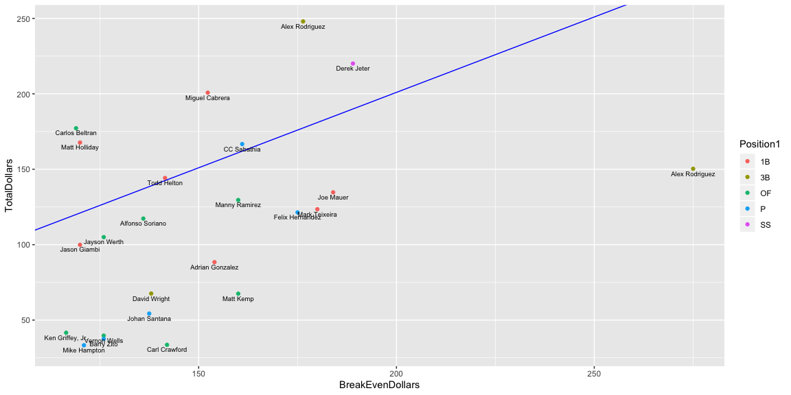

<br>

This is a personal project that I have began over Christmas break in 2019. I have noticed in baseball that a player that signs a long term contract (usually 6+ years), tends to be inconsistent in performance over the length of that contract. A lot of that can be attributed to either age or injury. I wanted to perform an analysis that looks at a player's performance based on the amount of money he is getting paid. I took the WAR estimate dollar amount of a player during each year of that contract and compared that dollar amount to the amount being paid to that player during the duration of that contract. I then created a simple linear regression model based heavily on the age of the player when a contract is signed and the length to estimate the performance of that player in millions of dollars. This project is far from finished, but was a fun way to dive into data during the Christmas holiday.

<br>


```r
df <- read.csv(file = "/Users/wes/Documents/StarWolf/Data/BCEdata.csv") %>% 
  filter(ContractCompletedRate == 1)

ggplot(df, aes(x=BreakEvenDollars, y=TotalDollars)) +
  geom_point(aes(col = Position1)) +
  geom_abline(slope = 1, intercept = 1, color = "blue") +
  geom_text(label=df$Name, cex = 2.5, nudge_y = -3)
```

<!-- -->

```r
mylm <- lm(ProfitDollars ~ TotalDollars + AgeAtContract, df)
summary(mylm)
```

```
## 
## Call:
## lm(formula = ProfitDollars ~ TotalDollars + AgeAtContract, data = df)
## 
## Residuals:
##      Min       1Q   Median       3Q      Max 
## -107.048  -11.880    4.057   17.151   48.024 
## 
## Coefficients:
##               Estimate Std. Error t value Pr(>|t|)    
## (Intercept)   -57.3328   122.8652  -0.467    0.646    
## TotalDollars    0.7393     0.1191   6.210 3.69e-06 ***
## AgeAtContract  -2.2323     4.0751  -0.548    0.590    
## ---
## Signif. codes:  0 '***' 0.001 '**' 0.01 '*' 0.05 '.' 0.1 ' ' 1
## 
## Residual standard error: 32.84 on 21 degrees of freedom
## Multiple R-squared:  0.6944,	Adjusted R-squared:  0.6653 
## F-statistic: 23.86 on 2 and 21 DF,  p-value: 3.922e-06
```

```r
predict(mylm, data.frame(TotalDollars = 425, AgeAtContract = 30), type = "response")
```

```
##        1 
## 189.8963
```

