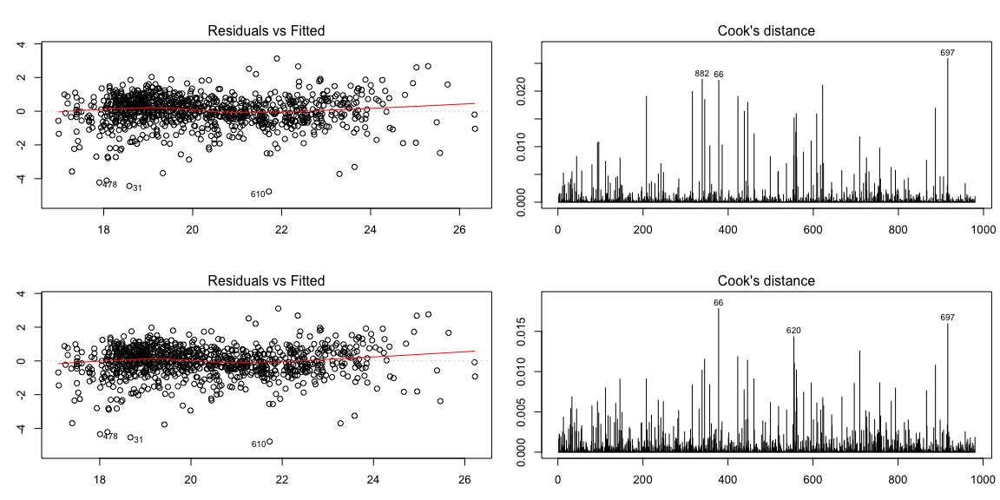

<br>

# {.tabset .tabset-pills .tabset-fade}

##Background & Analysis

<br>

For this analysis, we were given a dataset from a Kaggle competition. We were tasked to find a model to predict the sales prices of homes. When I first dived into the dataset, I gained understanding of the data by checking out the parirs plot and text description. I began by first making a rather complex model. I soon realized interpretation might be difficult, so I took a step back and removed all of my interaction and quadratic terms to make it easier to interpret. Let's dive into the play by play of the process I went through to develop my model.

<br>

I began thinking about what matters to people when they buy a home. I thought of the size of the home and accompanying land, the nieghborhood, the numbers of bedrooms and baths, etc. I first combined the total square footage of the first, second, and basement. I named this new column TotalSF. Here's the plot and the summary of the regression when I run TotalSF as the explanatory variable for SalesPrice.

<br>


```r
df <- read.csv(file = "HSPtrain.csv")
df_1 <- read.csv(file = "HSPtest.csv")

new_df <- df %>% 
  mutate(NewNeighborhood = as.numeric(as.factor(unlist(df[[13]])))) %>% 
  filter(TotalSF < 6500) %>% 
  filter(LotArea < 20000) %>% 
  filter(GarageCars < 4)

new_df$NeighborhoodNew [!new_df$Neighborhood %in% c("BrDale", "BrkSide", "Edwards", "IDOTRR", "MeadowV", "NAmes", "OldTown", "Sawyer", "SWISU")] <- 1
new_df$NeighborhoodNew [new_df$Neighborhood %in% c("BrDale", "BrkSide", "Edwards", "IDOTRR", "MeadowV", "NAmes", "OldTown", "Sawyer", "SWISU")] <- 0

new_df$Quality [new_df$OverallQual %in% c(7,8,9,10)] <- 1
new_df$Quality [!new_df$OverallQual %in% c(7,8,9,10)] <- 0

new_df$Bldg_Type [!new_df$BldgType %in% c("Duplex", "Twnhs")] <- 1
new_df$Bldg_Type [new_df$BldgType %in% c("Duplex", "Twnhs")] <- 0

n <- nrow(new_df)
keep <- sample(1:n,(n*.7))
my_train <- new_df[keep, ]
my_test <- new_df[-keep, ]
```


```r
sf.lm <- lm(SalePrice ~ TotalSF, data = new_df)
summary(sf.lm)
```

```
## 
## Call:
## lm(formula = SalePrice ~ TotalSF, data = new_df)
## 
## Residuals:
##     Min      1Q  Median      3Q     Max 
## -182794  -21275     509   22018  256371 
## 
## Coefficients:
##               Estimate Std. Error t value Pr(>|t|)    
## (Intercept) -29488.684   3987.889  -7.395 2.43e-13 ***
## TotalSF         81.972      1.513  54.166  < 2e-16 ***
## ---
## Signif. codes:  0 '***' 0.001 '**' 0.01 '*' 0.05 '.' 0.1 ' ' 1
## 
## Residual standard error: 42210 on 1400 degrees of freedom
## Multiple R-squared:  0.677,	Adjusted R-squared:  0.6767 
## F-statistic:  2934 on 1 and 1400 DF,  p-value: < 2.2e-16
```

```r
plot(SalePrice ~ TotalSF, data = new_df, col = "grey", pch = 16)
b <- coef(sf.lm)

curve(b[1] + b[2]*x, add = TRUE, col = "firebrick")
```

<!-- -->

<br>

It looks as if the the data here can be transformed. If I run a boxCox on my lm I find that lambda is around 0.25. If I rerun my plot from above, I get a nice smooth line and the model has improved somewhat with an adjusted r-squared value of 0.684.

<br>


```r
boxCox(sf.lm)
```

<!-- -->

```r
sf1.lm <- lm(sqrt(sqrt(SalePrice)) ~ TotalSF, data = new_df)
pander(summary(sf1.lm))
```


--------------------------------------------------------------
     &nbsp;        Estimate   Std. Error   t value   Pr(>|t|) 
----------------- ---------- ------------ --------- ----------
 **(Intercept)**    14.64       0.1058      138.3       0     

   **TotalSF**     0.002212   4.017e-05     55.08       0     
--------------------------------------------------------------


--------------------------------------------------------------
 Observations   Residual Std. Error   $R^2$    Adjusted $R^2$ 
-------------- --------------------- -------- ----------------
     1402              1.12           0.6842       0.684      
--------------------------------------------------------------

Table: Fitting linear model: sqrt(sqrt(SalePrice)) ~ TotalSF

```r
plot(sqrt(sqrt(SalePrice)) ~ TotalSF, data = new_df, col = "grey", pch = 16)
b <- coef(sf1.lm)

curve(b[1] + b[2]*x, add = TRUE, col = "firebrick")
```

<!-- -->

<br>

Following this, I then was curious to see if any other column could be used to show groups in my previous plot. I ran neighborhood in my lm and had 25 additional estimates, because the Neighbor column is qualitative. I grouped those that were significant and those that weren't. I created a new column and gave the significant values 1's and the non-significant values 0's. The following plot and summary show neighborhood included in my original linear regression of TotalSF predicting SalePrice. I also did a similar look at OverallQual and grouped those that were 7-10 (because they were significant) and those below as separate 1's and 0's.

<br>


```r
sf2.lm <- lm(sqrt(sqrt(SalePrice)) ~ TotalSF + TotalSF:NeighborhoodNew, data = new_df)
pander(summary(sf2.lm))
```


-----------------------------------------------------------------------------
           &nbsp;              Estimate    Std. Error   t value    Pr(>|t|)  
----------------------------- ----------- ------------ --------- ------------
       **(Intercept)**           15.64      0.09667      161.8        0      

         **TotalSF**           0.001489    4.419e-05     33.7     9.202e-183 

 **TotalSF:NeighborhoodNew**   0.0005466   2.186e-05      25      2.365e-114 
-----------------------------------------------------------------------------


--------------------------------------------------------------
 Observations   Residual Std. Error   $R^2$    Adjusted $R^2$ 
-------------- --------------------- -------- ----------------
     1402             0.9318          0.7818       0.7814     
--------------------------------------------------------------

Table: Fitting linear model: sqrt(sqrt(SalePrice)) ~ TotalSF + TotalSF:NeighborhoodNew

```r
b <- coef(sf2.lm)

plot(sqrt(sqrt(SalePrice)) ~ TotalSF, data = new_df, col = as.factor(NeighborhoodNew), pch = 16)
curve(b[1] + b[2]*x, col="black", lwd=2, add=TRUE)
curve(b[1] + (b[2] + b[3])*x, col="red", lwd=2, add=TRUE)
```

<!-- -->


```r
sf3.lm <- lm(sqrt(sqrt(SalePrice)) ~ TotalSF + TotalSF:Quality, data = new_df)
pander(summary(sf3.lm))
```


---------------------------------------------------------------------
       &nbsp;          Estimate    Std. Error   t value    Pr(>|t|)  
--------------------- ----------- ------------ --------- ------------
   **(Intercept)**       15.89       0.1092      145.5        0      

     **TotalSF**       0.001493    4.864e-05     30.69    1.297e-158 

 **TotalSF:Quality**   0.0004989   2.347e-05     21.25    4.337e-87  
---------------------------------------------------------------------


--------------------------------------------------------------
 Observations   Residual Std. Error   $R^2$    Adjusted $R^2$ 
-------------- --------------------- -------- ----------------
     1402             0.9745          0.7613       0.761      
--------------------------------------------------------------

Table: Fitting linear model: sqrt(sqrt(SalePrice)) ~ TotalSF + TotalSF:Quality

```r
b <- coef(sf3.lm)

plot(sqrt(sqrt(SalePrice)) ~ TotalSF, data = new_df, col = as.factor(Quality), pch = 16)
curve(b[1] + b[2]*x, col="black", lwd=2, add=TRUE)
curve(b[1] + (b[2] + b[3])*x, col="red", lwd=2, add=TRUE)
```

<!-- -->

<br>


```r
# dropped Quality and NeighborhoodNew
sf4.lm <- lm(sqrt(sqrt(SalePrice)) ~ TotalSF + TotalSF:NeighborhoodNew + TotalSF:Quality + NewNeighborhood:Quality, data = my_train)
pander(summary(sf4.lm))
```


----------------------------------------------------------------------------
           &nbsp;              Estimate    Std. Error   t value   Pr(>|t|)  
----------------------------- ----------- ------------ --------- -----------
       **(Intercept)**           16.01       0.1227      130.5        0     

         **TotalSF**           0.001305     5.62e-05     23.22    2.456e-95 

 **TotalSF:NeighborhoodNew**   0.0004132   2.835e-05     14.58    1.095e-43 

     **TotalSF:Quality**       0.0001378   4.396e-05     3.134    0.001776  

 **Quality:NewNeighborhood**    0.03048     0.006881     4.429    1.053e-05 
----------------------------------------------------------------------------


--------------------------------------------------------------
 Observations   Residual Std. Error   $R^2$    Adjusted $R^2$ 
-------------- --------------------- -------- ----------------
     981              0.8908          0.8032       0.8024     
--------------------------------------------------------------

Table: Fitting linear model: sqrt(sqrt(SalePrice)) ~ TotalSF + TotalSF:NeighborhoodNew + TotalSF:Quality + NewNeighborhood:Quality

```r
b <- coef(sf4.lm)

plot(sqrt(sqrt(SalePrice)) ~ TotalSF, data = new_df, col = interaction(NeighborhoodNew, Quality), pch = 16)

ColNeither <- "black"
ColNeighborhoodOn <- "red"
ColQualityOn <- "green3"
ColBothOn <- "blue"

NeighborhoodOn <- 0
QualityOn <- 0

curve(b[1] +
        (b[2]+b[3]*NeighborhoodOn+b[4]*QualityOn)*x, 
        add = TRUE, 
        col = ColNeither)

NeighborhoodOn <- 1
QualityOn <- 0

curve(b[1] +
        (b[2]+b[3]*NeighborhoodOn+b[4]*QualityOn)*x, 
        add = TRUE, 
        col = ColNeighborhoodOn)

NeighborhoodOn <- 0
QualityOn <- 1

curve(b[1] +
        (b[2]+b[3]*NeighborhoodOn+b[4]*QualityOn)*x, 
        add = TRUE, 
        col = ColQualityOn)

NeighborhoodOn <- 1
QualityOn <- 1

curve(b[1] +
        (b[2]+b[3]*NeighborhoodOn+b[4]*QualityOn)*x, 
        add = TRUE, 
        col = ColBothOn)
```

<!-- -->


##Model Validation & Interpretation

<br>


```r
# Compute R-squared for each validation
# Get y-hat for each model on new data.
finallm <- sf4.lm

finallm <- lm(sqrt(sqrt(SalePrice)) ~ TotalSF + TotalSF:NeighborhoodNew + TotalSF:Quality + NewNeighborhood:Quality, data = my_test)

yht <- predict(finallm, newdata=my_test)
# Compute y-bar
Ynew <- my_test$SalePrice
ybar <- mean(Ynew) #Yi is given by Ynew
  
# Compute SSTO
SSTO <- sum( (Ynew - ybar)^2 )
  
# Compute SSE for each model
SSE <- sum( (Ynew - yht)^2 )
  
# Compute R-squared for each
rs <- 1 - SSE/SSTO
  
# Compute adjusted R-squared for each
n <- length(Ynew)
pt <- length(coef(finallm))
rsa <- 1 - (n-1)/(n-pt)*SSE/SSTO
```


| Model   | Adjusted $R^2$ Train Data | Adjusted $R^2$ Test Data |
|---------|-------|----------------| 
| Final Model    | 0.8032307  | 0.8099938 |

<br>


```r
pander(b)
```


--------------------------------------------------------------------
 (Intercept)   TotalSF    TotalSF:NeighborhoodNew   TotalSF:Quality 
------------- ---------- ------------------------- -----------------
    16.01      0.001305          0.0004132             0.0001378    
--------------------------------------------------------------------

Table: Table continues below

 
-------------------------
 Quality:NewNeighborhood 
-------------------------
         0.03048         
-------------------------

<br>

I got a pretty good adjusted r-squared value of around 0.80. It is a simple model overall, whichh makes it pretty simple to interpret. I have four lines and a short explanation of each found below:

(0,0) black line: This is where neighborhood and quality are turned off. This is my base line where totalSF interprets my SalePrice. 

(1,0) red line: Neighborhood is turned on here. This looks at the interaction between totalSF and Neighborhood, which is a 0,1 variable. The intercept was not significant, but the slope was. We can see a difference in the prices of homes where neighborhood is accounted for.

(0,1) green line: Quality is turned on here, with neighborhood switched off. We don't notice as much of a difference here, but it is significant. The interaction between quality and totalSF impacts the base line. We can see that there SalePrice increases when Quality is higher.

(1,1) blue line: This last line looks at when both neighborhood and quality are accounted for. We can see that this is the highest group in my graph. This shows that when they live in a nice neighborhood and have a nice home, then there SalePrice will be higher than the other groups.

I learned a lot from this analysis. There are many factors that influence SalePrice. I chose to keep it relatively simple, but sometimes those models are the best as they are more easily interpreted.


```r
r.lm <- rlm(sqrt(sqrt(SalePrice)) ~ TotalSF + TotalSF:NeighborhoodNew + TotalSF:Quality + NewNeighborhood:Quality, data = my_train)
pander(summary(sf4.lm))
```


----------------------------------------------------------------------------
           &nbsp;              Estimate    Std. Error   t value   Pr(>|t|)  
----------------------------- ----------- ------------ --------- -----------
       **(Intercept)**           16.01       0.1227      130.5        0     

         **TotalSF**           0.001305     5.62e-05     23.22    2.456e-95 

 **TotalSF:NeighborhoodNew**   0.0004132   2.835e-05     14.58    1.095e-43 

     **TotalSF:Quality**       0.0001378   4.396e-05     3.134    0.001776  

 **Quality:NewNeighborhood**    0.03048     0.006881     4.429    1.053e-05 
----------------------------------------------------------------------------


--------------------------------------------------------------
 Observations   Residual Std. Error   $R^2$    Adjusted $R^2$ 
-------------- --------------------- -------- ----------------
     981              0.8908          0.8032       0.8024     
--------------------------------------------------------------

Table: Fitting linear model: sqrt(sqrt(SalePrice)) ~ TotalSF + TotalSF:NeighborhoodNew + TotalSF:Quality + NewNeighborhood:Quality

```r
summary(r.lm)
```

```
## 
## Call: rlm(formula = sqrt(sqrt(SalePrice)) ~ TotalSF + TotalSF:NeighborhoodNew + 
##     TotalSF:Quality + NewNeighborhood:Quality, data = my_train)
## Residuals:
##     Min      1Q  Median      3Q     Max 
## -4.8061 -0.5172  0.0409  0.5242  3.0472 
## 
## Coefficients:
##                         Value    Std. Error t value 
## (Intercept)              16.1152   0.1108   145.4696
## TotalSF                   0.0013   0.0001    25.4077
## TotalSF:NeighborhoodNew   0.0004   0.0000    15.8229
## TotalSF:Quality           0.0001   0.0000     3.2931
## Quality:NewNeighborhood   0.0314   0.0062     5.0498
## 
## Residual standard error: 0.7754 on 976 degrees of freedom
```

```r
p.lm <- lm(sqrt(sqrt(SalePrice)) ~ TotalSF + TotalSF:NeighborhoodNew + TotalSF:Quality + NewNeighborhood:Quality, data = my_train[-479,])

par(mfrow=c(2,2), mai=c(.5,.5,.5,.1))
plot(p.lm, which=c(1,4))
plot(r.lm, which=c(1,4))
```

<!-- -->

```r
pander(summary(p.lm))
```


----------------------------------------------------------------------------
           &nbsp;              Estimate    Std. Error   t value   Pr(>|t|)  
----------------------------- ----------- ------------ --------- -----------
       **(Intercept)**           16.01       0.1227      130.5        0     

         **TotalSF**           0.001305     5.62e-05     23.21    3.037e-95 

 **TotalSF:NeighborhoodNew**   0.000413    2.835e-05     14.57    1.214e-43 

     **TotalSF:Quality**       0.0001373   4.396e-05     3.124    0.001837  

 **Quality:NewNeighborhood**    0.03044     0.006881     4.424    1.077e-05 
----------------------------------------------------------------------------


--------------------------------------------------------------
 Observations   Residual Std. Error   $R^2$    Adjusted $R^2$ 
-------------- --------------------- -------- ----------------
     980              0.8909          0.8027       0.8019     
--------------------------------------------------------------

Table: Fitting linear model: sqrt(sqrt(SalePrice)) ~ TotalSF + TotalSF:NeighborhoodNew + TotalSF:Quality + NewNeighborhood:Quality

```r
pander(summary(sf4.lm))
```


----------------------------------------------------------------------------
           &nbsp;              Estimate    Std. Error   t value   Pr(>|t|)  
----------------------------- ----------- ------------ --------- -----------
       **(Intercept)**           16.01       0.1227      130.5        0     

         **TotalSF**           0.001305     5.62e-05     23.22    2.456e-95 

 **TotalSF:NeighborhoodNew**   0.0004132   2.835e-05     14.58    1.095e-43 

     **TotalSF:Quality**       0.0001378   4.396e-05     3.134    0.001776  

 **Quality:NewNeighborhood**    0.03048     0.006881     4.429    1.053e-05 
----------------------------------------------------------------------------


--------------------------------------------------------------
 Observations   Residual Std. Error   $R^2$    Adjusted $R^2$ 
-------------- --------------------- -------- ----------------
     981              0.8908          0.8032       0.8024     
--------------------------------------------------------------

Table: Fitting linear model: sqrt(sqrt(SalePrice)) ~ TotalSF + TotalSF:NeighborhoodNew + TotalSF:Quality + NewNeighborhood:Quality

##Diagonostic Plots


```r
par(mfrow=c(1,3))
plot(sf4.lm, which=c(1,4,5))
```

<!-- -->

<br>

There's some definite errors here. The points that stand out to me are 1178, 1131, and 697. I could try removing them or doing a robust linear regression to see where it ends.

<br>
