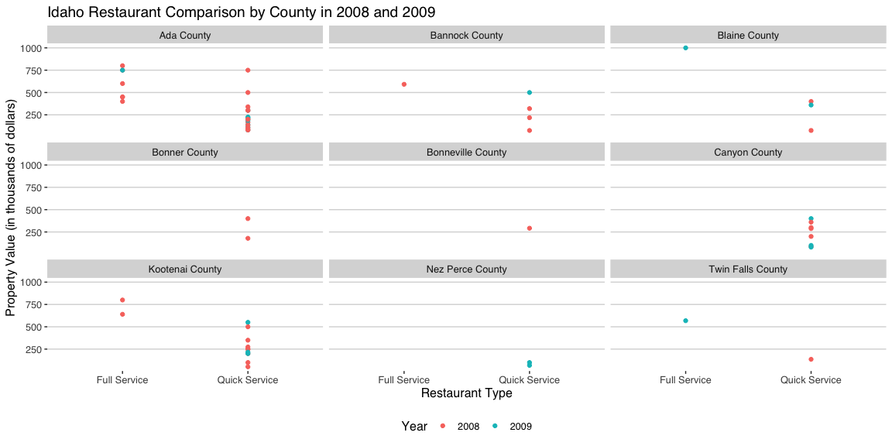
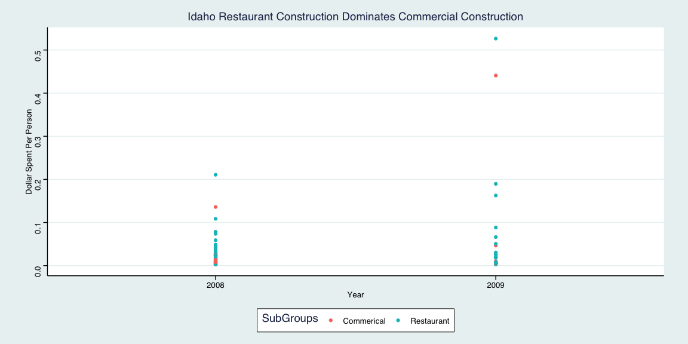
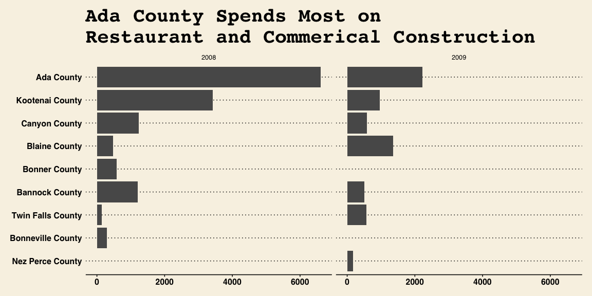
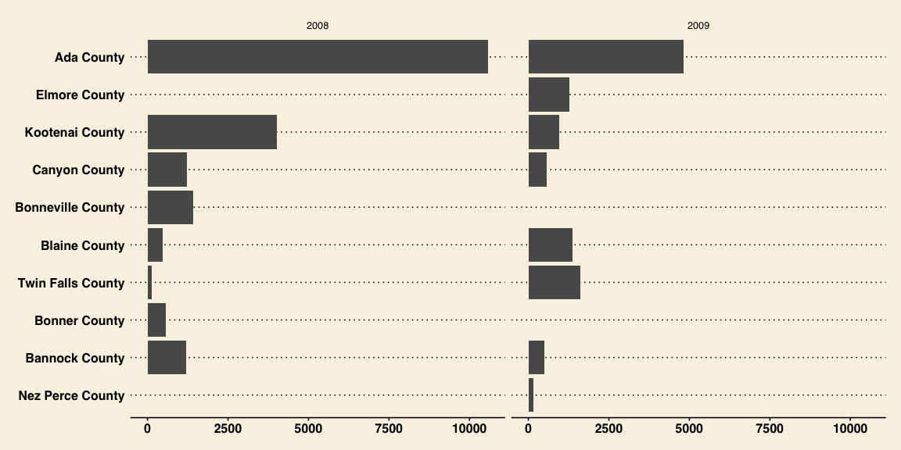

```r
library(tidyverse)
library(ggthemes)
library(buildings)
```


1. How did full-service restaurant construction compare to quick service restaurant construction across county and years?
2. How did restaurant construction fare compare to the other commercial construction in Idaho?
3. Which county in Idaho spent the most on fast food construction each year?
4. In that county how did other commercial construction compare?


```r
devtools::install_github("hathawayj/buildings")

buildings_data <- buildings::buildings0809
climate_zone_fips <- buildings::climate_zone_fips
permits <- buildings::permits
restaurants <- buildings::restaurants
```


```r
not_restaurants1 <- c("development","Food preperation center", "Food Services center","bakery","Grocery","conceession","Cafeteria", "lunchroom","school","facility"," hall ")
not_restaurants <- str_trim(not_restaurants1) %>% 
  str_c(collapse = "|")

standalone_retail1 <- c("Wine","Spirits","Liquor","Convenience","drugstore","Flying J", "Rite Aid ","walgreens ","Love's Travel ")
standalone_retail <- str_trim(standalone_retail1) %>% 
  str_c(collapse = "|")

full_service_type1 <- c("Ristorante","mexican","pizza ","steakhouse"," grill ","buffet","tavern"," bar ","waffle","italian","steak house")
full_service_type <- str_trim(full_service_type1) %>% 
  str_c(collapse = "|")

quick_service_type1 <- c("coffee"," java "," Donut ","Doughnut"," burger ","Ice Cream ","custard ","sandwich ","fast food "," bagel ")
quick_service_type <- str_trim(quick_service_type1) %>% 
  str_c(collapse = "|")

quick_service_names1 <- restaurants$Restaurant[restaurants$Type %in% c("coffee","Ice Cream","Fast Food")]
quick_service_names <- str_trim(quick_service_names1) %>% 
  str_c(collapse = "|")

full_service_names1 <- restaurants$Restaurant[restaurants$Type %in% c("Pizza","Casual Dining","Fast Casual")]
full_service_names <- str_trim(full_service_names1) %>% 
  str_c(collapse = "|")
```


```r
# Joining climate_zone_fips to buildings 0809 by using the two FIPS columns
buildings_climate <- buildings_data %>% 
  left_join(climate_zone_fips, by = c("FIPS.state", "FIPS.county")) %>% 
  filter(Type == "Food_Beverage_Service") %>% 
  mutate(SubGroups = case_when(
    str_detect(str_to_lower(ProjectTitle), not_restaurants) ~ "Not Restaurant",
    str_detect(str_to_lower(ProjectTitle), standalone_retail) ~ "Standalone Retail",
    str_detect(str_to_lower(ProjectTitle), full_service_type) ~ "Full Service Type",
    str_detect(str_to_lower(ProjectTitle), quick_service_type) ~ "Quick Service Type",
    str_detect(str_to_lower(ProjectTitle), quick_service_names) ~ "Quick Service Names",
    str_detect(str_to_lower(ProjectTitle), full_service_names) ~ "Full Service Names", 
    SqFt > 4000 ~ "Full Service",
    SqFt < 4000 ~ "Quick Service",
    T ~ "Other"))

buildings_climate1 <- buildings_data %>% 
  left_join(climate_zone_fips, by = c("FIPS.state", "FIPS.county")) %>% 
  filter(Type == "Food_Beverage_Service") %>% 
  mutate(SubGroups = case_when(
    str_detect(str_to_lower(ProjectTitle), not_restaurants) ~ "Commerical",
    str_detect(str_to_lower(ProjectTitle), standalone_retail) ~ "Commerical",
    str_detect(str_to_lower(ProjectTitle), full_service_type) ~ "Commerical",
    str_detect(str_to_lower(ProjectTitle), quick_service_type) ~ "Commerical",
    str_detect(str_to_lower(ProjectTitle), quick_service_names) ~ "Commerical",
    str_detect(str_to_lower(ProjectTitle), full_service_names) ~ "Commerical", 
    SqFt > 4000 ~ "Restaurant",
    SqFt < 4000 ~ "Restaurant",
    T ~ "Restaurant"))
```


For my first plot, I looked at the type of construction across counties and years. I found that 2008 had much more construction than 2009. I found that Ada county had the most construction overall, which makes sense as Boise is in Ada county. Also, looking at construction by years we see that 2008 had much more construction than 2009.

<br>


```r
idaho_restaurants <- buildings_climate %>% 
  filter(SubGroups == "Quick Service" | SubGroups == "Full Service")

ggplot(data = idaho_restaurants) +
  geom_point(aes(x = SubGroups, y = Value1000, color = Year)) +
  facet_wrap( ~ AreaName, ncol = 3, nrow = 3) +
  theme_hc() +
  labs(title = "Idaho Restaurant Comparison by County in 2008 and 2009",
       x = "Restaurant Type",
       y = "Property Value (in thousands of dollars)")
```

<!-- -->

<br>
The second graph looks at the second question dealing with Restraunt and Commerical Constrution by year. I created a new column that looks at the value spent on the construction and divided that by the number of people in the county. It appears that restaurant construction dominates the commercial sphere.
<br>


```r
idaho_restaurants2 <- buildings_climate1 %>% 
  group_by(AreaName) %>%
  mutate(new_col = (Value1000 * 1000) / (Pop100 * 100))

ggplot(data = idaho_restaurants2, aes(x = Year, y = new_col, color = SubGroups)) +
  geom_point() +
  theme_stata() +
  labs(x = "Year",
       y = "Dollar Spent Per Person",
       title = "Idaho Restaurant Construction Dominates Commercial Construction")
```

<!-- -->

<br>
The last question was: Which county in Idaho spent the most on fast food construction each year? The top graph looks at Restaurant construction by county and year. Ada county is the leader here. The bottom graph looks at the final question. As we are looking at the county that has the most restaurant construction, we can again see that Ada county leads in the commercial sphere. So the rumor that all of the nice construction goes to Boise in Idaho is true. Hence the potholes.
<br>


```r
idaho_restaurants3 <- buildings_climate %>% 
  filter(SubGroups == "Quick Service" | SubGroups == "Full Service") %>% 
  group_by(AreaName, SubGroups, Year) %>%
  summarise(cost = sum(Value1000))
  
idaho_restaurants4 <- buildings_climate %>% 
  filter(SubGroups != "Quick Service" | SubGroups != "Full Service") %>% 
  group_by(AreaName, SubGroups, Year) %>%
  summarise(cost = sum(Value1000))

ggplot(data = idaho_restaurants3, aes(reorder(AreaName, cost), cost), fill = "dodgerblue") + 
  geom_col() +
  facet_grid( ~ Year) +
  coord_flip() +
  theme_wsj() +
  labs(title = "Ada County Spends Most on \nRestaurant and Commerical Construction")
```

<!-- -->

```r
ggplot(data = idaho_restaurants4, aes(reorder(AreaName, cost), cost), fill = "firebrick") + 
  geom_col() +
  facet_grid( ~ Year) +
  coord_flip() +
  theme_wsj()
```

<!-- -->

